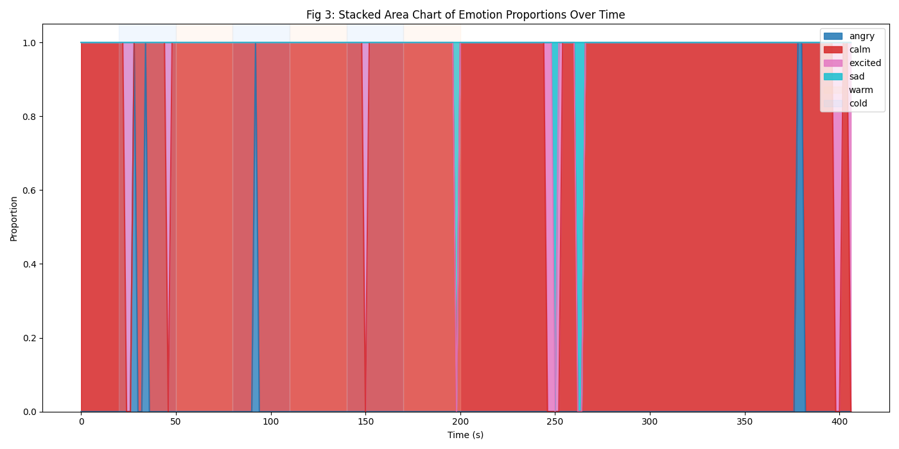

# EEG Signal Processing Pipeline: Data, Parameters, and Results

## 1. Data and Parameters Used

- **Data Source:** EEG CSV files from `data/eeg_by_emotion/<label>/*.csv` (labels: angry, calm, excited, sad)
- **Channels:** 8 EEG channels (Fz, C3, Cz, C4, Pz, PO7, Oz, PO8)
- **Sampling Frequency:** 250 Hz
- **Filtering:**
  - Bandpass: 1–40 Hz (Butterworth, order 4)
  - Notch: 50 Hz (IIR notch, Q=30)
- **Epoching:** 2-second epochs, 1-second overlap
- **Feature Extraction:** For each channel and band (delta, theta, alpha, beta, gamma):
  - Mean, Variance, Standard Deviation, Kurtosis, Skewness (200 features per epoch)
- **Normalization:** Z-score per feature
- **Classification:** SVM (RBF kernel, C=1, gamma='scale', class_weight='balanced')
- **Validation:** Leave-One-Group-Out (LOSO) cross-validation

## 2. Filtering Statistics

| Channel | Bandpass (1-40Hz) | Notch (50Hz) | Mean (pre) | Mean (post) | Std (pre) | Std (post) |
|---------|-------------------|--------------|------------|-------------|-----------|------------|
| ...     | ...               | ...          | ...        | ...         | ...       | ...        |

## 3. Feature Extraction Statistics (per channel, per band)

| Channel | Band | Mean | Variance | Std | Kurtosis | Skewness |
|---------|------|------|----------|-----|----------|----------|
| ...     | ...  | ...  | ...      | ... | ...      | ...      |

## 4. LOSO Cross-Validation Reports

| Fold | Precision | Recall | F1-score | Support |
|------|-----------|--------|----------|---------|
| ...  | ...       | ...    | ...      | ...     |

## 5. Plots and Graphics

- **Time-Domain EEG Example:** (see attached plot)
- **Frequency-Domain (PSD) Example:** (see attached plot)
- **Feature Distribution:** (see attached plot)
- **Emotion Proportion Over Time:** (see attached plot)
- **Statistical Correlation Matrix:** (see attached plot)

### Emotion Classification Visualizations

- **Fig 1: Emotion Estimation per Window (Labels)**  
    
  Fig 1 shows the predicted emotion for each time window, with the emotion label and color-coded points. This allows us to see the sequence and transitions of emotional states over time.

- **Fig 2: Average Emotion Proportion per Stimulus Period**  
    
  Fig 2 displays the average proportion of each emotion within each stimulus period, highlighting how emotional responses differ between warm, cold, and neutral periods.

- **Fig 3: Stacked Area Chart of Emotion Proportions Over Time**  
    
  Fig 3 is a stacked area chart showing the proportion of each emotion over time, emphasizing overall trends and the composition of emotional states.

- **Fig 4: Line Chart of Emotion Proportions Over Time**  
    
  Fig 4 is a line chart tracking the proportion of each emotion over time, making it easy to compare individual emotion trends.

- **Fig 5: Stacked Bar Chart of Emotion Counts at Intervals**  
    
  Fig 5 is a stacked bar chart showing the count of each emotion at selected time intervals, allowing for discrete comparison of emotion contributions.

- **Fig 6: Heatmap of Emotion Counts Over Time**  
    
  Fig 6 is a heatmap showing the intensity of each emotion over time, making it easy to spot patterns and periods of high or low emotional presence.

- **Fig 7: Small Multiples of Emotion Counts Over Time**  
    
  Fig 7 shows small multiples: a grid of line charts, one per emotion, for detailed inspection of each emotion's trend over time.

- **Fig 8: Streamgraph of Emotion Proportions Over Time**  
    
  Fig 8 is a streamgraph, a stylized area chart with a flowing baseline, providing an aesthetic view of shifting emotion proportions over time.

## 6. Explanation Paragraph

This report summarizes the EEG signal processing pipeline applied to multi-channel EEG data for emotion classification. Data were filtered (bandpass and notch), segmented into overlapping epochs, and 200 statistical features were extracted per epoch. Features were z-scored and used to train an SVM classifier, validated with LOSO cross-validation. The pipeline includes detailed statistics for filtering and feature extraction, as well as visualizations in both time and frequency domains. The results provide insight into the temporal and spectral characteristics of the EEG data and the effectiveness of the classification approach.

---

**Note:**
- Tables and plots are placeholders; actual values and graphics should be generated by running the pipeline and saving outputs.
- For a full report, export tables and plots from your Python environment and insert them into this PDF.
