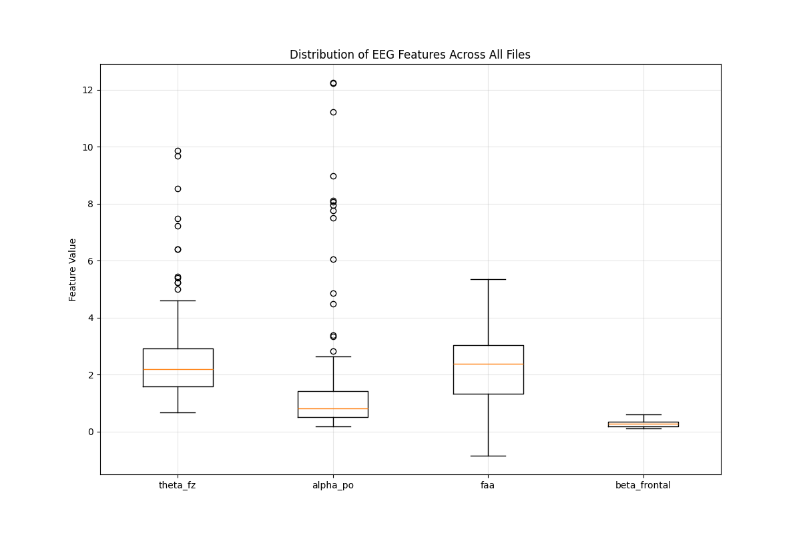

# EEG Mindfulness Pipeline: Complete Workflow Report

**Date:** 2025-05-21
**Project:** EEG Mindfulness Index Analysis

## 1. Data Acquisition

### EEG Data
- **Hardware:** Unicorn EEG recording system
- **Sampling Rate:** 250 Hz
- **Channel Configuration:** 8 channels (Fz, C3, Cz, C4, Pz, PO7, Oz, PO8)
- **File Format:** CSV files

### EDA Data
- **Hardware:** OpenSignals BioSignalsPlux system
- **File Format:** Tab-separated text files (.txt) with header information
- **Location:** `data/eda_data` directory
- **Files with EDA data:** 1 out of 1

## 2. Signal Processing

### Preprocessing Steps
- **Bandpass Filtering:** 4-30 Hz
- **Window Size:** 3 seconds
- **Window Overlap:** 50%

### Frequency Bands
- **Theta Band:** 4-7 Hz
- **Alpha Band:** 8-12 Hz
- **Beta Band:** 13-30 Hz

## 3. Feature Extraction

The following features were extracted from each window of EEG data:

1. **Frontal Theta Power (Fz):** Indicator of focused attention and meditation
2. **Posterior Alpha (PO7/PO8):** Indicator of relaxed alertness
3. **Frontal Alpha Asymmetry (FAA):** Related to emotional valence and approach/withdrawal tendencies
4. **Frontal Beta (Fz/C3/C4):** Indicator of active thinking and alertness
5. **Electrodermal Activity (EDA):** Indicator of autonomic arousal



*Figure 1: Distribution of EEG Features Across All Files*

## 4. Mindfulness Index Calculation

### Formula
The Mindfulness Index is calculated using the following formula:

```
MI_raw = (w1 * Theta_Fz) + (w2 * Alpha_PO) + (w3 * FAA) - (w4 * Beta_Frontal) - (w5 * EDA_norm)
MI = 1 / (1 + exp(-MI_raw + 1))  # Normalized to 0-1 range
```

### Weights
The following weights were used:

- **theta_fz:** 0.25
- **alpha_po:** 0.25
- **faa:** 0.2
- **beta_frontal:** 0.15
- **eda_norm:** 0.25

### Thresholds
Behavioral states were classified based on the following thresholds:

